## USER AND SHOW INTERACTION ANALYSIS IN A RATING PLATFORM

## INTRODUCTION
This project analyzes large scale rating data to understand how users interact with shows including both movies and TV series and how engagement is distributed across the catalog. The objective is to study user behavior and content reception from a behavioral perspective, focusing on interaction patterns rather than content semantics or recommendation accuracy.

The analysis adopts a data driven approach that combines exploratory analysis, predictive modeling, and unsupervised learning to identify structural regularities in user activity, popularity dynamics, and rating behavior. By relying exclusively on interaction data, the project demonstrates that meaningful and interpretable patterns can be uncovered even in the absence of demographic or content based features.

Overall, the work aims to provide insights into how attention concentrates on a small subset of content, how users differ in engagement intensity and evaluation style, and how these dimensions interact to shape platform dynamics.

## DATASET

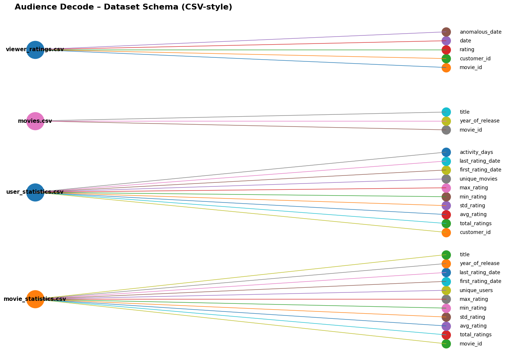

The dataset describes a rating platform centered on shows and includes user�show interaction data collected over time. It consists of several relational tables containing individual rating events, show metadata, and aggregated statistics at both user and show level.

Overall, the dataset contains over 4 million rating interactions, more than 430,000 users, and approximately 14,500 distinct shows. While the catalog is dominated by movies, the presence of TV series is explicitly identified, allowing the analysis to account for differences between standalone and episodic content.

This structure enables the study of engagement patterns at multiple levels, from individual interactions to aggregated behavioral profiles.

## METHODOLOGY
### Data Handling

Data handling focuses on ensuring internal consistency and reliability while preserving the original scale of the dataset. Missing values and invalid entries are analyzed column by column across all tables, and cleaning decisions are applied selectively rather than uniformly.

Invalid rating values outside the valid range are identified and corrected, while missing ratings are handled conservatively to avoid unnecessary data loss. Aggregated user- and show-level statistics are validated and reconstructed from the cleaned interaction data when needed. Only records that cannot be reliably recovered are removed.

Overall, fewer than 0.4% of rows are discarded across all datasets, ensuring that the analysis is based on a large and representative sample while maintaining data quality.

## EXPLORATORY DATA ANALYSIS

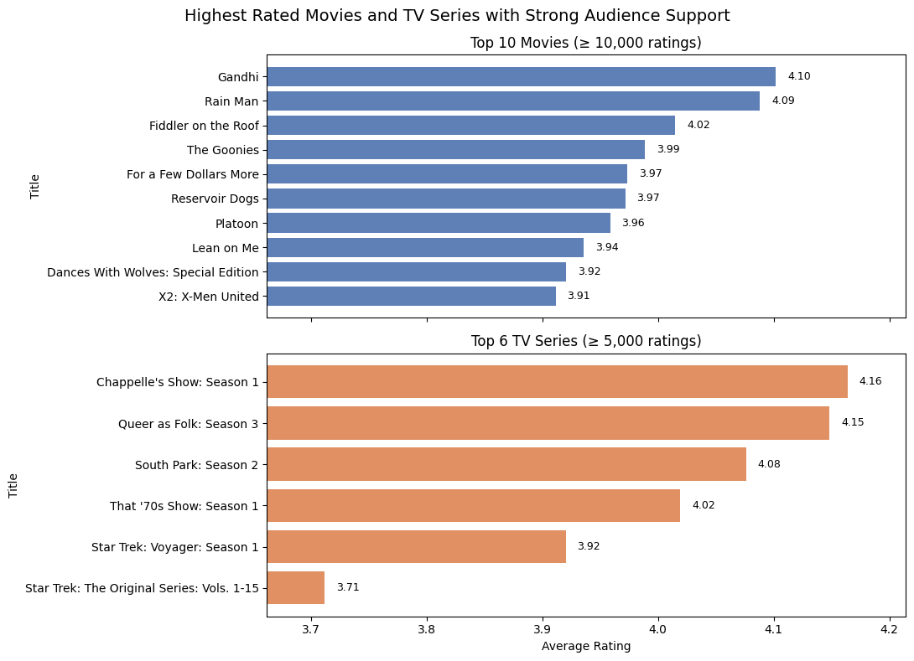

The exploratory data analysis aims to identify global engagement and rating patterns in the dataset. Rather than focusing on exhaustive descriptive statistics, the analysis highlights structural regularities that characterize user behavior and show reception.

Several robust patterns emerge:
. Popularity bias: shows with few ratings display extreme average values and high variance, while shows with large audiences converge toward stable mean ratings between 3 and 4.

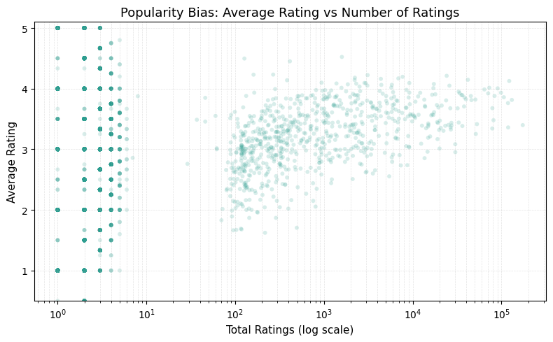

. Temporal effects: shows released around 2004/2005 receive both high rating volume and relatively high average scores.

  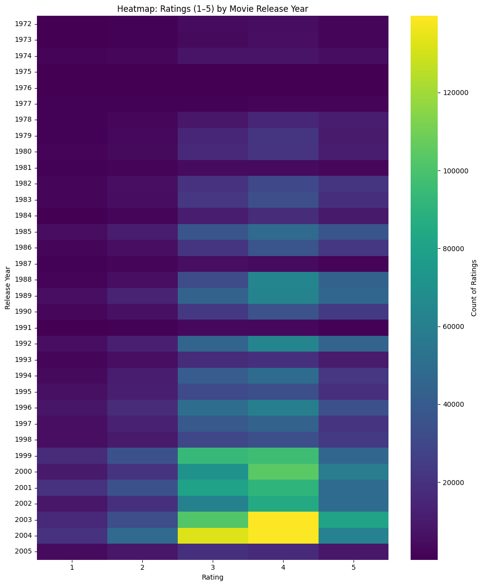
  
. Content type differences: movie ratings remain relatively stable over time, whereas TV series exhibit higher volatility, reflecting episodic consumption and stronger audience polarization.

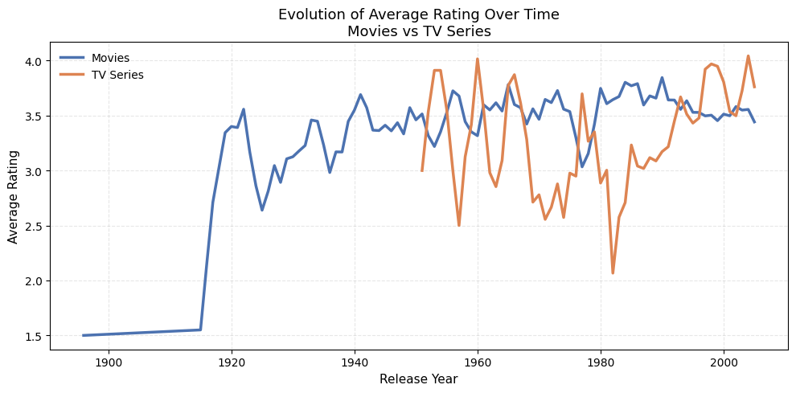

 Polarization: a small subset of shows exhibits very high rating standard deviation, identifying highly divisive titles that receive both very positive and very negative evaluations.

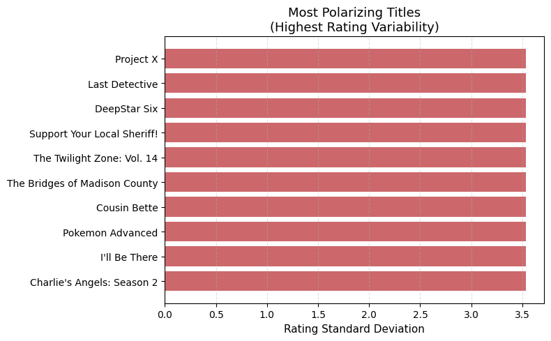

Overall, the analysis highlights strong popularity effects, rating instability for low-support items, and systematic differences between movies and TV series in how ratings are expressed.

## LINEAR REGRESSION

The regression analysis focuses on predicting long-run show popularity, defined as the total number of ratings a show receives over its lifetime. Instead of modeling average ratings which are largely explained by linear aggregates the task targets a more informative outcome related to sustained user engagement.

The model uses only information available during the first 30 active days of a show. To reduce noise and ensure reliable early signals, only shows with at least 30 ratings within this period are considered, reducing the dataset from 14,531 shows to 772. These are split into training and test sets.

The regression is performed on a log-transformed target, capturing relative growth patterns rather than absolute scale. On the test set, the model achieves:
* R**2 ≈ 0.45
* RMSE ≈ 1.41
* MAE ≈ 1.11

These results indicate moderate predictive accuracy, showing that early engagement contains substantial information about long-run popularity while leaving room for uncertainty, especially for extremely popular shows.

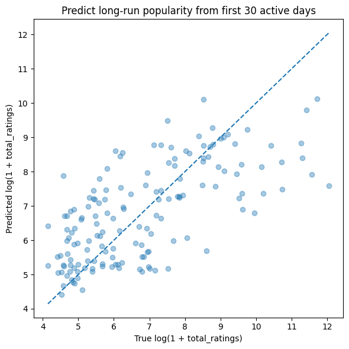

## CLUSTERING (USERS & SHOWS)

Clustering is used to group users and shows into homogeneous segments based on observed behavior and rating characteristics. To avoid conflating different dimensions, clustering is performed separately on engagement related features and rating style features, each capturing a distinct aspect of interaction.

### Behavioral Clustering – K-means

Behavioral clustering focuses on participation patterns, capturing how users and shows engage with the platform over time. This dimension describes differences in activity intensity, persistence, and overall involvement, independently of how ratings are expressed. The goal is to identify distinct behavioral roles within the platform ecosystem.

### Movie Behavioral Clusters

Cluster 0 : Popular catalog titles :
Shows dominating engagement, combining high visibility with long term persistence.

Cluster 1 : One shot titles :
Shows receiving very limited attention and remaining marginal in terms of engagement.

Cluster 2 : Long tail titles:
Shows experiencing brief spikes of attention followed by rapid decline.

Cluster 3 : Blockbuster / evergreen titles :
Shows with stable and sustained engagement over long periods.

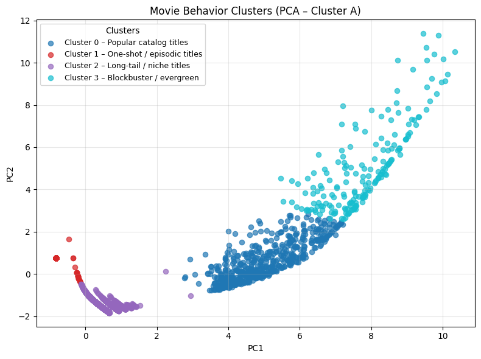
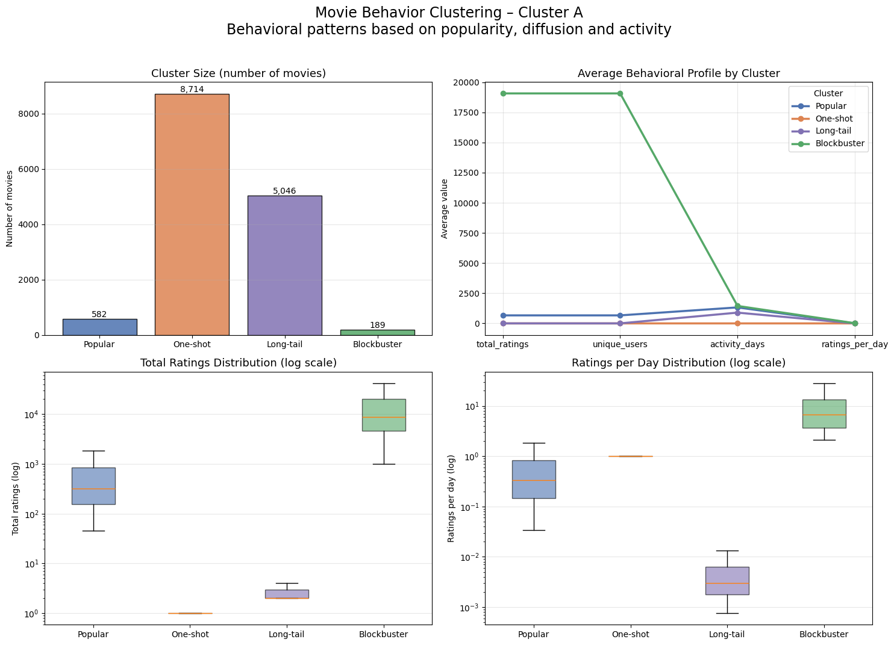

### User Behavior Clusters

Cluster 0 : Casual users  :
Users with very limited and short-lived activity, interacting with only a few shows in a narrow time window.

Cluster 1 :  One-time users :
Users who participate consistently over time but with low interaction volume and limited exploration.

Cluster 2 : Regular users :
The largest group of users, characterized by moderate engagement and a broader but still selective interaction with the catalog.

Cluster 3 : Power users :
Highly active users with long participation spans and extensive interaction across the catalog.

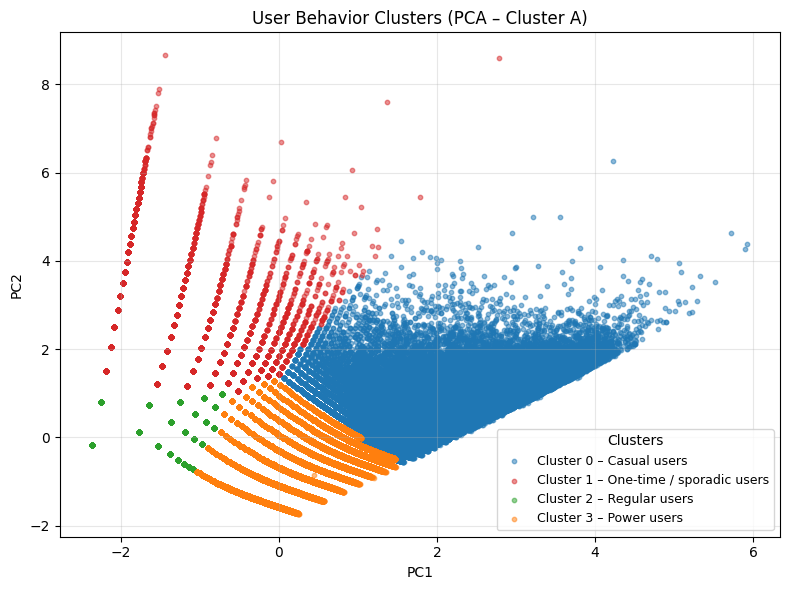
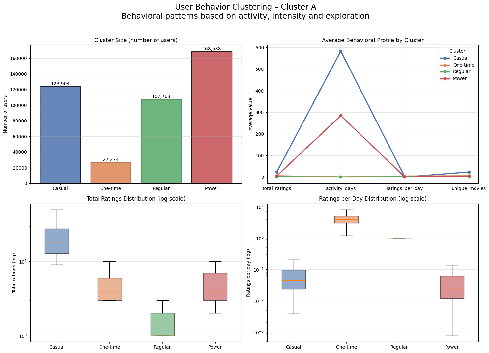

### Rating Style Clustering – Hierarchical

Rating style clustering focuses on how evaluations are expressed, independently of interaction volume or popularity. This dimension captures systematic tendencies in rating behavior, describing differences in generosity, strictness, and opinion variability rather than differences in activity intensity.

### Movie Rating Style Clusters

Cluster 0 : High rated / stable titles :
Shows receiving consistently positive evaluations.

Cluster 1 : Polarizing titles :
Shows generating mixed reactions and strong disagreement among viewers.

Cluster 2 : Low rated titles :
Shows characterized by consistently negative reception

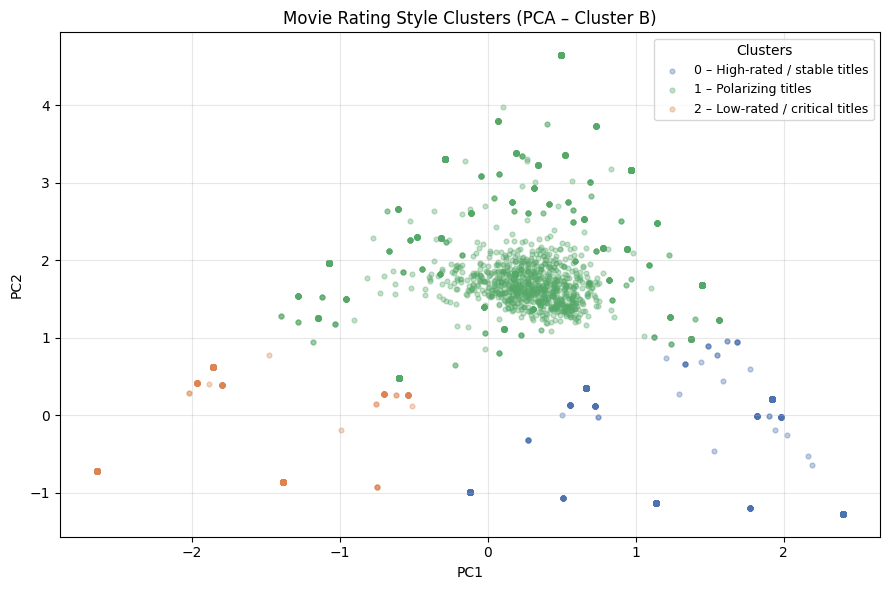
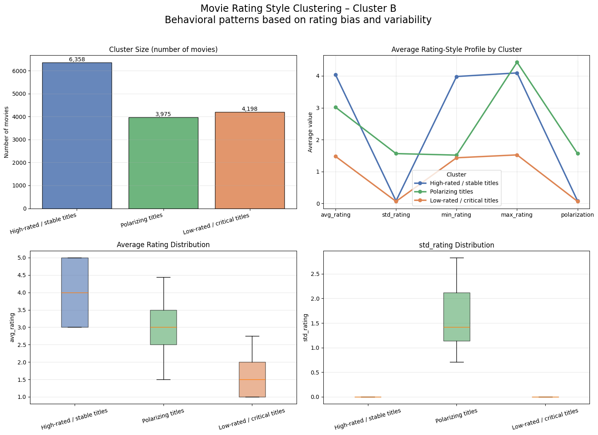

### User Rating Style Clusters

Cluster 1 – Generous raters :
Users who tend to assign higher ratings across most interactions.

Cluster 2 – Moderate raters :
Users whose ratings concentrate around neutral values.

Cluster 3 – Critical raters :
Users who consistently assign lower and more compressed ratings.

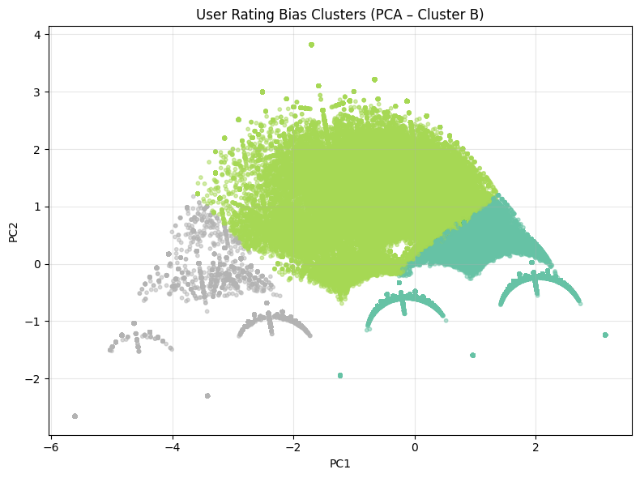
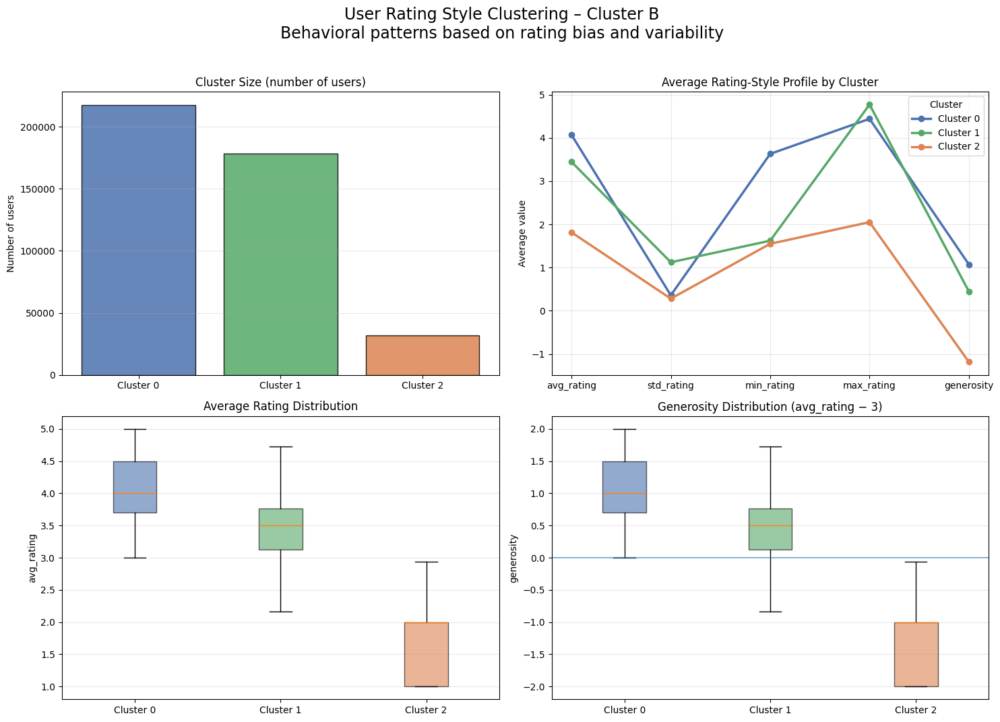

### CROSS CLUSTER INTERACTION ANALYSIS

To understand how the identified clusters interact, cross cluster relationships are analyzed by examining interactions between user clusters and show clusters. This analysis reveals collective consumption dynamics that are not visible when clusters are considered in isolation.

### User behavior × Show behavior

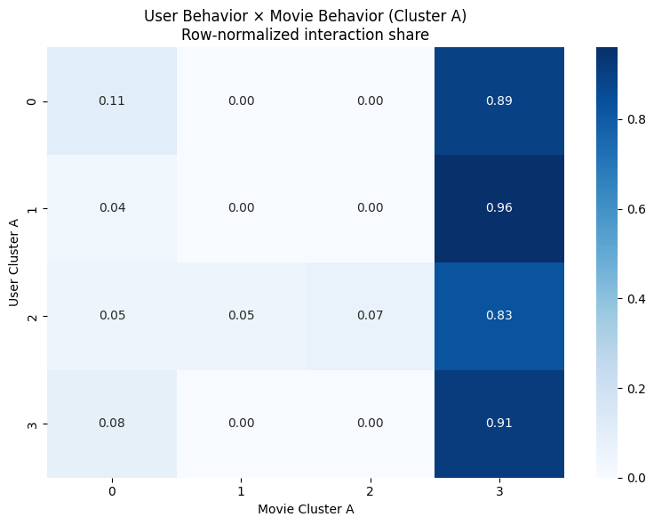

Across all user behavioral segments, interactions are strongly concentrated on blockbuster and evergreen titles. Casual and one time users almost exclusively consume highly popular shows, while regular users show only limited diversification. Even power users, despite their higher activity, remain primarily focused on blockbuster content.

### User rating style × Show rating style

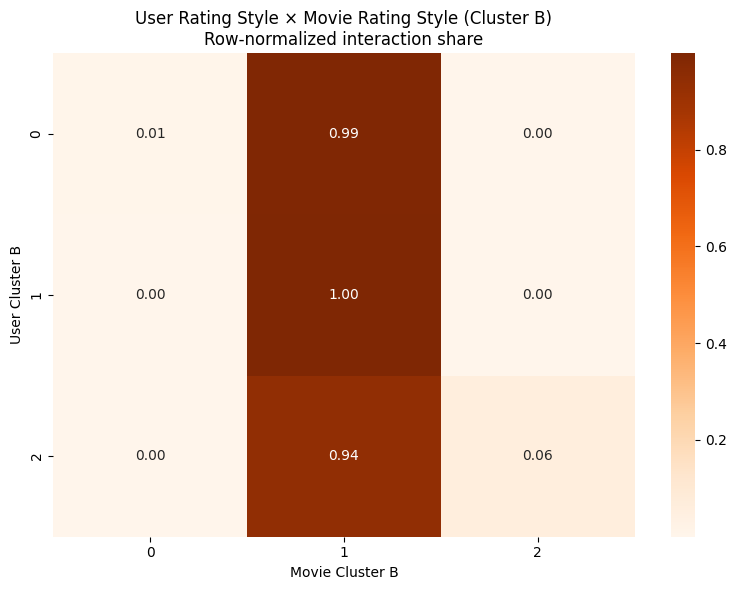

Across rating style clusters, users interact most frequently with polarizing shows, regardless of individual rating bias. High rated and stable titles receive comparatively fewer interactions.
Overall, these interaction patterns show that popularity and polarization jointly shape platform dynamics, reinforcing concentration effects and limiting cross cluster diversity.

## KEY FINDINGS
- Engagement on the platform is highly concentrated, with a small fraction of shows accounting for a disproportionate share of interactions.
- User activity is strongly heterogeneous; power users generate a large fraction of ratings despite being a minority.
- Early engagement explains approximately 45% of the variance in long-run show popularity.
- Consumption behavior is driven primarily by visibility and popularity, not by exploration.
- Rating behavior exhibits systematic bias across users.
- Polarizing shows attract more attention than consistently high rated titles.

## CONCLUSION

This project provides a structured and data driven analysis of user show interactions on a large scale rating platform. By focusing exclusively on interaction data, the analysis reveals clear and interpretable patterns in engagement intensity, popularity dynamics, and rating behavior.
The results show that platform activity is shaped by concentration effects rather than content diversity. Behavioral differences among users coexist with strong commonalities in consumption choices, while rating styles introduce an additional, independent dimension of variability.
Overall, the combination of exploratory analysis, predictive modeling, and unsupervised learning proves effective in uncovering latent structure in complex interaction data.

## LIMITATIONS & FUTURE WORK
The analysis relies exclusively on interaction and rating data. The absence of economic variables, content descriptors, and user demographics limits deeper segmentation and profitability-oriented analysis. Including these dimensions would enable richer modeling and more detailed insights into engagement dynamics.

